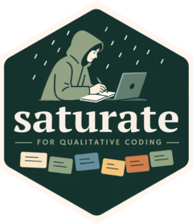

# saturate 

<!-- badges: start -->
[](https://github.com/woodtho/saturate/actions/workflows/R-CMD-check.yaml)
[](https://lifecycle.r-lib.org/articles/stages.html#experimental)
[](https://opensource.org/licenses/MIT)
<!-- badges: end -->

**saturate** is a modern R replacement for the [RQDA](https://github.com/RQDA/RQDA) package. It provides a full qualitative data analysis (CAQDAS) workflow backed by [DuckDB](https://duckdb.org/) — one portable `.satdb`/`.duckdb` file per project — with an interactive Shiny GUI for text coding, codebook management, and multi-coder collaboration.

## Features

- **File-based projects** — each project is a single `.satdb` file; no server required
- **Rich coding UI** — select passages, assign codes, add confidence levels and memos
- **Codebook management** — hierarchical categories, code relations, weights, and full history
- **Multi-coder workflows** — split a project for independent coders, merge results back
- **Audio recording & transcription** — record directly in the browser or upload audio, transcribe with local [whisper](https://github.com/bnosac/whisper), import with optional timestamps
- **Saturation analysis** — plot theoretical saturation curves and triangulation grids
- **Inter-rater reliability** — Cohen's kappa, Krippendorff's alpha, and agreement matrices
- **Member checking** — generate and track participant feedback on interpreted themes
- **Export** — DOCX, XLSX, and tidy tibbles for downstream analysis

## Installation

```r
# Install from GitHub
pak::pak("woodtho/saturate")
```

## Quick start

```r
library(saturate)

# Create a new project
proj <- qc_new("my_study.duckdb", name = "My Study")

# Import documents
qc_import_document(proj, "interview_01.txt")
qc_import_document(proj, "interview_02.docx")

# Add codes
qc_add_code(proj, "empowerment", colour = "#4CAF50")
qc_add_code(proj, "barrier",     colour = "#F44336")

# Launch the GUI
shiny_saturate(proj)

# When done, close the connection
qc_close(proj)
```

## Multi-coder workflow

```r
# Researcher splits the master project into a coder copy
contrib_path <- "coder_alice.duckdb"
qc_split_project(master, contrib_path)

# Alice codes independently, then returns the file.
# Researcher merges back:
result <- qc_merge_project(master, contrib_path)
# list(codes_added = 0, sources_added = 0, codings_added = 47, ...)

# Calculate agreement
qc_agreement(master, coders = c("researcher", "alice"))
```

## Analysis

```r
# Saturation curve
qc_plot_saturation(proj)

# Code co-occurrence heatmap
qc_plot_cooccurrence(proj)

# Retrieve coded segments as a tidy tibble
segments <- qc_get_coded_segments(proj, codes = "empowerment")

# Export full report to DOCX
qc_export(proj, "report.docx", format = "docx")
```

## Audio transcription

saturate can transcribe audio recordings directly inside the GUI. This requires the optional `whisper` and `av` packages:

```r
install.packages(c("whisper", "av"))
```

Open the **Documents** tab and click **Record & transcribe…** to:

- Record audio from your microphone (pause, resume, and save the raw file)
- Upload an existing audio file (`.webm`, `.ogg`, `.mp4`, `.mp3`, `.wav`, `.m4a`)
- Transcribe with a local whisper model (no data leaves your machine)
- Include segment timestamps in the transcript (on by default)
- Import the edited transcript as a document, or export it as `.txt` or `.docx`

Whisper models are downloaded once and cached locally. The `tiny` model (~74 MB) works well for English; `small` or `medium` are better for accented speech or other languages.

## License

MIT © Thomas Wood
